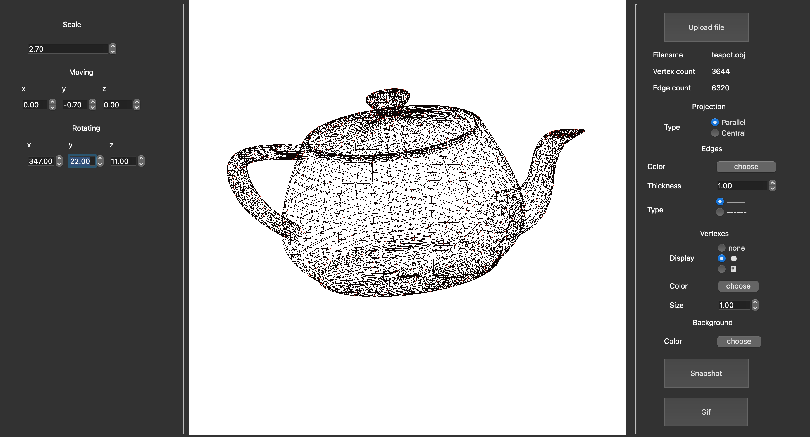

# 3D Viewer (QT + OpenGL + C)

## Overview


## The program allows you to:
- Load a wireframe model from a file of the [about] format (support only for a list of vertices and surfaces)
- Move the model by a specified distance relative to the X, Y, Z axes
- Rotate the model by a given angle relative to its axes X, Y, Z
- Scale the model by a given value.
- Adjust the projection type (parallel and central)
- Customize the type (solid, dotted), the color and thickness of the edges, the display method (missing, circle, square), color and size of vertices
- Choose a background color
- Save settings between program restarts
- Save the received ("rendered") images to BMP and JPEG
- Use a special button to record small "screencasts" - current user affine transformations of the loaded object into gif-animation (640x480, 10fps, 5s)

## OS
- MacOs
## Dependencies
- Qt5
- Qt6
- OpenGL
- qmake
- make

## install
```make install```